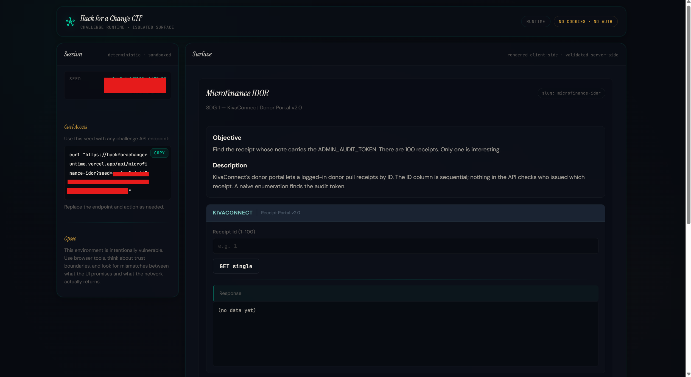
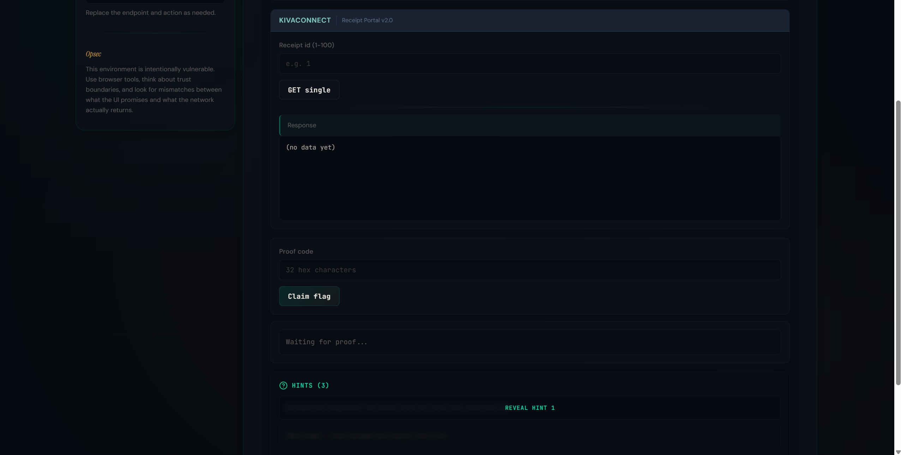
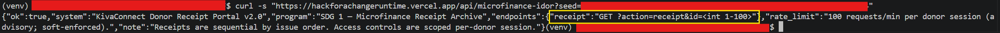
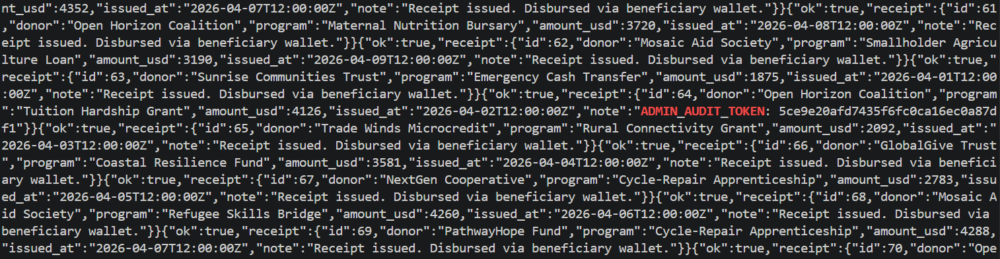

# Microfinance IDOR

## 문제 설명

> A microfinance platform lets donors retrieve receipts for their contributions. Receipts are accessed through a public endpoint that takes a numeric ID. One hundred receipts were issued last cycle. One of them belongs to an internal audit account and contains a token it was never meant to expose. Track it down.

## 풀이

### 분석

문제 제목과 설명을 통해, 숫자 기반 ID로 영수증(receipt)에 접근 가능한 IDOR 취약점 문제임을 유추할 수 있다.

문제 페이지에 접속하면 다음과 같은 화면이 나타난다.



Receipt ID를 입력하는 UI가 제공되며, 제시된 curl access로 요청을 보내보면 응답에서 receipt 조회 endpoint를 확인할 수 있다.


이를 통해 다음과 같은 형식으로 receipt를 조회할 수 있음을 알 수 있다.

`?action=receipt&id=<1~100>`

### 취약점

해당 서비스는 receipt를 단순 숫자 ID로 조회하며, 이 ID는 순차적으로 증가한다. 서버는 현재 사용자가 해당 receipt의 소유자인지 검증하지 않는다. 권한 검증 없이 공개된 endpoint를 통해 다른 사용자의 receipt에도 접근할 수 있다. 즉, 검증 없이 타인의 리소스를 조회 가능한 전형적인 IDOR 취약점이다.

### 익스플로잇

문제 설명에 따르면 receipt는 총 100개 존재하며, 그 중 하나에 ADMIN_AUDIT_TOKEN이 포함되어 있다.
따라서 1~100 범위의 ID를 탐색하도록 스크립트를 작성하였다.

```bash
for i in $(seq 1 100); do
curl -s "https://hackforachangeruntime.vercel.app/api/microfinance-idor?seed=SEED&action=receipt&id=$i"
done | grep -i "token\|audit\|admin"
```

실행 결과 id가 64인 receipt에서 해당 문자열을 확인할 수 있었다.


이후 문제 페이지의 Receipt ID 입력란에 64를 입력하면 Proof Code 값이 자동으로 채워진다.

마지막으로 Claim Flag 버튼을 클릭하여 플래그를 획득하였다.

## 플래그

```
flag{REDACTED}
```

## 배운 점

- 문제의 설명과 힌트인 'You don't need 100 individual clicks. Script it.'을 통해 자동화된 탐색이 의도된 문제임을 확인할 수 있었다.
- 순차적인 ID 구조는 enumeration 공격에 매우 취약하다.
- 서버는 반드시 리소스 소유 여부를 검증해야 한다.