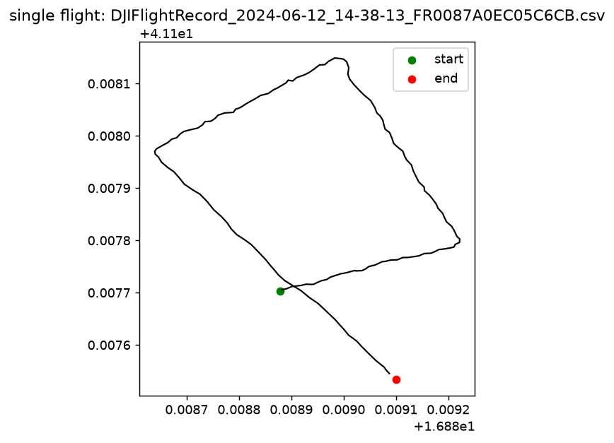
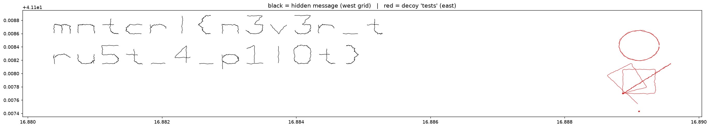
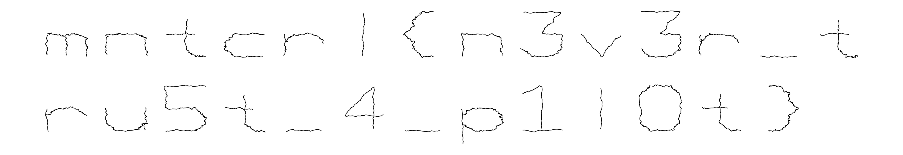

# waypoint

## 문제 설명

> A pilot says he just did "some tests" on the university campus.
> The flight logs tell a different story.
> Recover the message he was trying to send.
>
> Flag format: mntcrl{...}

- 첨부 파일: `DJIFlightRecord_*.csv` 51개 (DJI 드론 비행 기록)

## 풀이

### 분석

첨부된 csv는 전부 DJI 드론의 비행 로그였다.  
좌표 `41.108, 16.881` 은 이탈리아 Bari의 Politecnico di Bari 캠퍼스다.  
각 파일의 위/경도 중심점과 이동 범위를 뽑아보니 비행이 두 구역으로 나뉘었다.

- **서쪽 구역** (`lon < 16.888`): 좁은 격자 위에 41개의 비행이 촘촘히 배치
- **동쪽 구역** (`lon >= 16.888`): 10개의 비행이 각각 원/직선/사각형 같은 단순 도형을 그림

`height` 는 약 30m로 거의 일정하고 `yaw` 값은 무작위라 실제 사람이 조종한 비행이라기보다 비행 경로 자체가 그림인것으로 보였다.

비행 경로를 `longitude`(x) - `latitude`(y) 평면에 그리면 한 비행이 하나의 획/도형을 그린다.

먼저 동쪽 구역의 한 비행을 그려보면, 깔끔한 원이 나온다. "비행 1개 = 그림 1개" 라는 걸 확인할 수 있다.



동쪽의 원/직선/사각형 등 단순 도형들은 파일럿이 말한 "그냥 테스트" 였고,
진짜 메시지는 서쪽 격자에 있었다. 전체를 색으로 구분해서 그리면 다음과 같다.
(검정 = 서쪽 메시지, 빨강 = 동쪽 테스트)



### 익스플로잇

서쪽(메시지) 비행들을 따로 떼어내서, 각 비행을 실제 GPS 좌표 그대로 한 캔버스에 겹쳐 그리면 글자들이 배치된다.  

```python
import csv, glob, os
import matplotlib; matplotlib.use("Agg")
import matplotlib.pyplot as plt

def smooth(v, w=5):
    return [sum(v[max(0,i-w//2):min(len(v),i+w//2+1)]) /
            len(v[max(0,i-w//2):min(len(v),i+w//2+1)]) for i in range(len(v))]

for path in glob.glob("*.csv"):
    lon, lat = [], []
    with open(path, encoding="utf-8-sig") as f:
        r = csv.reader(f); next(r)
        for row in r:
            lat.append(float(row[2])); lon.append(float(row[3]))
    clon = sum(lon) / len(lon)
    if clon < 16.888:                       # 서쪽 = 숨겨진 메시지만 선택
        plt.plot(smooth(lon), smooth(lat), "-", lw=1.0, color="black")

plt.gca().set_aspect("equal"); plt.axis("off")
plt.savefig("message.png", dpi=160, bbox_inches="tight")
```

> 전체 스크립트는 [`solve.py`](solve.py) 참고. 미끼 도형 예시, 구역 오버뷰, 최종 메시지 이미지를 모두 생성한다.

결과 이미지에 플래그가 두 줄로 그대로 나타난다.



윗줄: `mntcrl{n3v3r_t`
아랫줄: `ru5t_4_p1l0t}`

이어 붙이면 플래그가 된다.  

## 플래그

```
mntcrl{REDACTED}
```

## 배운 점

- 좌표 이동을 지도에 그리면 그림이 나타날 거라는 생각은 바로 할 수 있었으나 분석 스크립트 제작은 아이디어를 AI에 맡기는 편이 훨씬 빨랐다.
